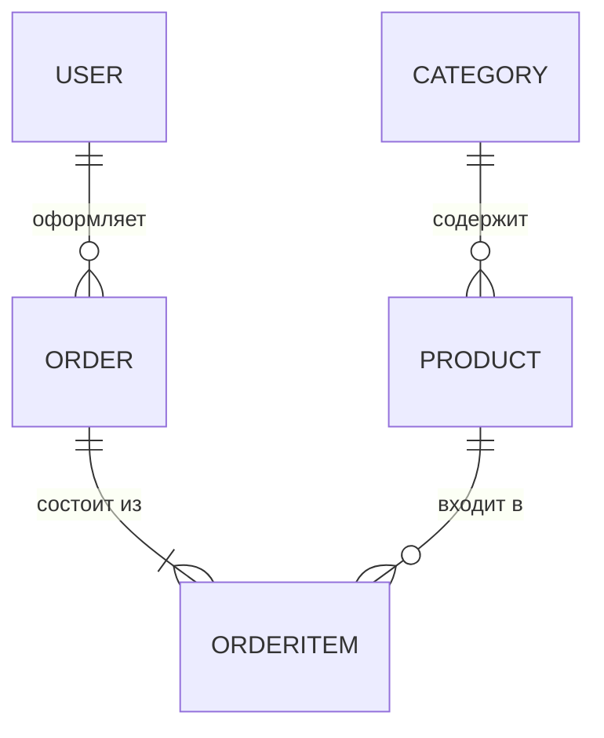

# Модели данных

Проект построен на ORM Django: каждая модель — это таблица в базе данных, а взаимодействие с ней идёт через Python-код, без написания SQL вручную.

## Схема связей

- `||--o{` — связь «один ко многим»: слева одна запись, справа — ноль или много.
- `||--|{` — «один и обязательно много»: заказ не может существовать без позиций.

## Обзор моделей

| Модель | Назначение |
| ------ | ---------- |
| `Category` | Категории товаров (игровые, офисные ПК и т.д.) |
| `Product` | Товары — сборки ПК с ценой, описанием и изображением |
| `Order` | Заказ покупателя: контакты, адрес, статус оплаты |
| `OrderItem` | Позиция внутри заказа: товар, цена, количество |
| `User` | Встроенная модель аутентификации Django (не переопределялась) |

## Category — категории

| Поле | Тип | Описание |
| ---- | --- | -------- |
| `name` | CharField(200) | Название, индексируется в БД (`db_index=True`) |
| `slug` | SlugField(200, unique) | URL-идентификатор, уникальный — используется в адресах страниц |

Метод `get_absolute_url()` возвращает URL страницы категории по её slug.

## Product — товары

| Поле | Тип | Описание |
| ---- | --- | -------- |
| `category` | ForeignKey → Category | Связь «многие к одному»; при удалении категории товары удаляются (`CASCADE`) |
| `name` | CharField(200) | Название товара |
| `slug` | SlugField(200) | Часть URL страницы товара |
| `description` | TextField | Описание, может быть пустым |
| `image` | ImageField | Изображение, сохраняется в `media/products/ГГГГ/ММ/ДД` |
| `price` | DecimalField(10, 2) | Цена; `Decimal` вместо `Float` — точные денежные расчёты без ошибок округления |
| `available` | BooleanField | Флаг наличия |
| `created` / `updated` | DateTimeField | Даты создания и изменения, заполняются автоматически |

Для ускорения выборок задан составной индекс по полям `id` и `slug`.

## Order — заказы

| Поле | Тип | Описание |
| ---- | --- | -------- |
| `first_name`, `last_name` | CharField(50) | Имя и фамилия покупателя |
| `email`, `phone`, `address` | CharField / EmailField | Контактные данные и адрес доставки |
| `paid` | BooleanField | Оплачен ли заказ |
| `status` | CharField с choices | Статус: новый → обрабатывается → оплачен → доставлен (или отменён) |
| `user` | ForeignKey → User | Связь с аккаунтом; `null=True` — заказ можно оформить и без регистрации |

Метод `get_total_cost()` суммирует стоимость всех позиций заказа.

!!! note "Почему у заказа есть и `paid`, и `status`"
    `paid` — быстрый булев флаг для проверок в коде, `status` — полный жизненный цикл заказа для администратора. Это разные задачи, поэтому разделены.

## OrderItem — позиции заказа

| Поле | Тип | Описание |
| ---- | --- | -------- |
| `order` | ForeignKey → Order | Принадлежность к заказу |
| `product` | ForeignKey → Product | Какой товар куплен |
| `price` | DecimalField(10, 2) | Цена на момент покупки |
| `quantity` | PositiveIntegerField | Количество |

!!! tip "Почему цена хранится в OrderItem, а не берётся из Product"
    Цена фиксируется в момент оформления заказа. Если позже товар подорожает, старые заказы должны показывать ту цену, по которой покупатель реально платил. Это стандартная практика проектирования интернет-магазинов.

Метод `get_cost()` возвращает стоимость позиции: `price × quantity`.
